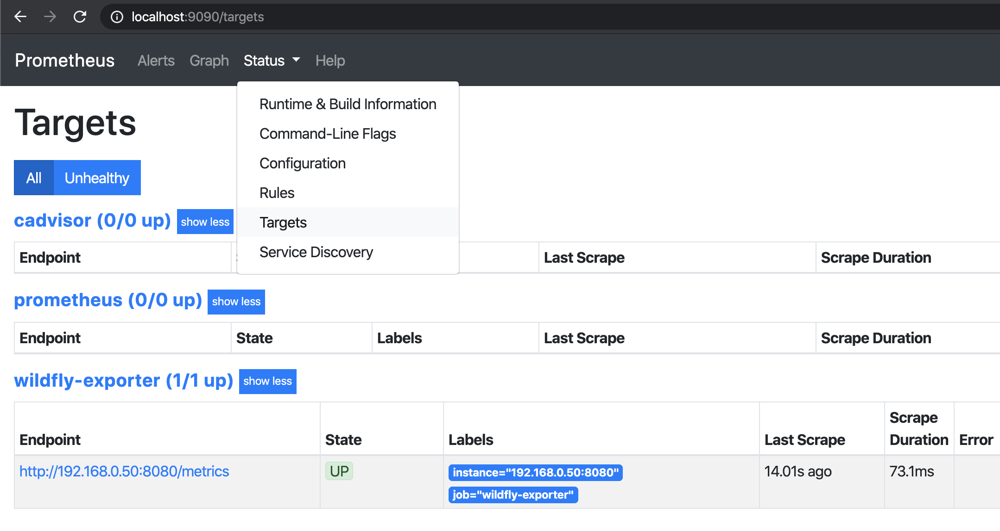
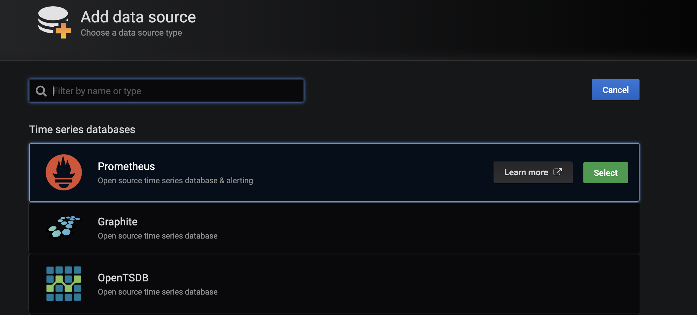
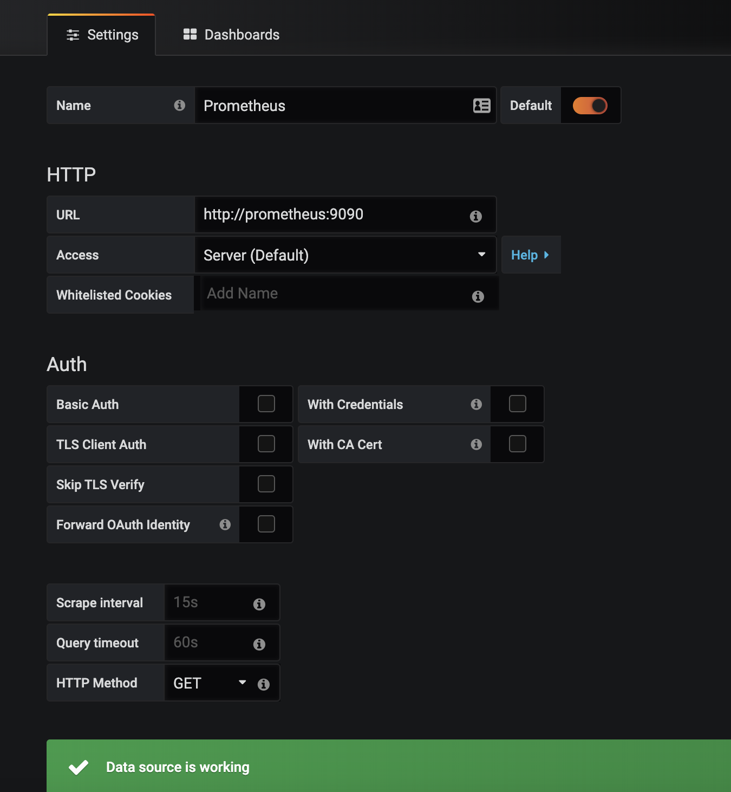
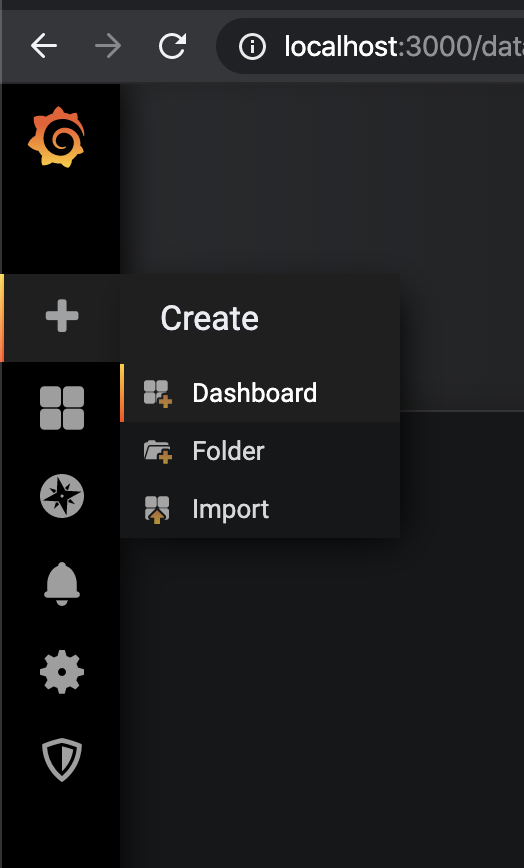
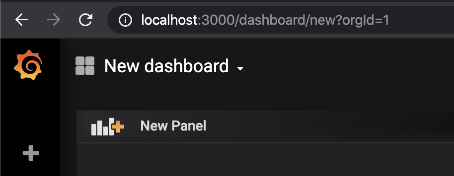
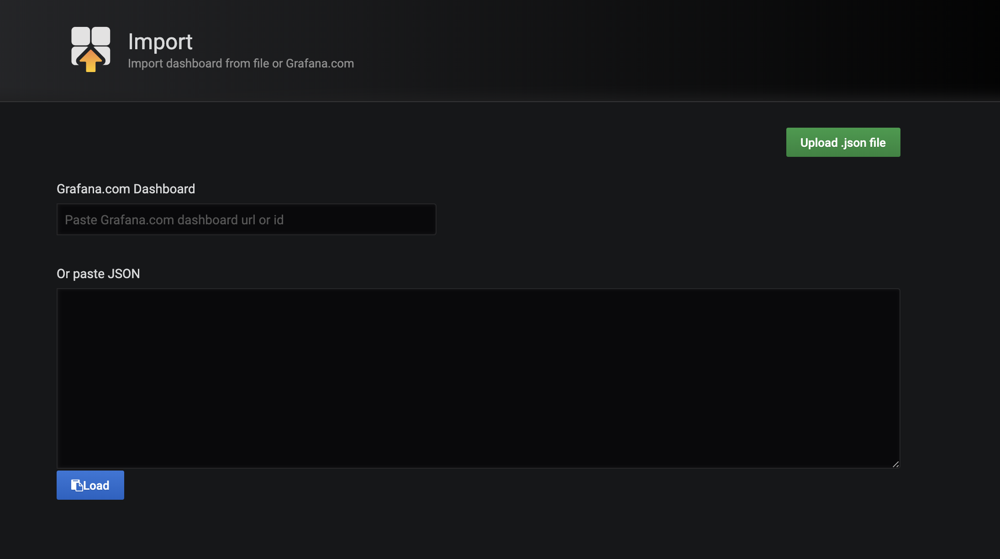

# Coletando métricas do Wildfly

## Saiba o que ocorre com a sua JVM!

O monitoramento e a visibilidade do ambiente sempre foram de grande importância para avaliação de performance, prevenção de problemas e correção de falhas. Atualmente ferramentas como o Prometheus podem coletar métricas de máquinas e serviços para nos auxiliar nessas questões, e o Grafana nos ajuda a ter uma visibilidade melhor dessas métricas com  a criação de dashboards e gráficos.

Porém sempre foi um desafio realizar o monitoramento de uma JVM, neste post veremos como realizar a coleta de métricas de uma JVM Wildfly com Prometheus e Grafana utilizando um exporter do Prometheus.
As novas versões de Wildfly (a partir da 15), já possuem um subsystem que gera uma página de métricas e que pode ser acessada normalmente pelo browser, assim não se faz necessário a utilização do exporter do Prometheus. Em nosso laboratório iremos demonstrar como realizar a coleta em versões anteriores a 15, pois estas que não possuem o subsystem se tornam um desafio em poder ter uma visibilidade da JVM.

## *Pré-requisitos:*

* Utilizar um SO Linux
* GIT (<https://git-scm.com/book/en/v2/Getting-Started-Installing-Git)>
* Docker e Docker Compose (<https://docs.docker.com/install/linux/docker-ce/ubuntu/> | <https://docs.docker.com/compose/install/)>
* Wildfly 14 ou anterior (<https://wildfly.org/downloads/)>

---

## Download do Projeto

Todos os arquivos necessários para a execução do nosso laboratório estão em um repositório do GitHub, assim, com o git instalado em sua máquina, escolha um diretório para ser o seu workspace e realize o clone do projeto com o seguinte comando:

```bash
git clone https://github.com/CaeirOps/wildfly-exporter.git
```

---

## Habilitando as Métricas

Após o clone do repositório iremos então começar a configurar nosso Wildfly para exportar as métricas que serão coletadas pelo Prometheus. O exporter que iremos utilizar é mantido pela comunidade e pode ser encontrado no repositório "<https://github.com/nlighten/wildfly_exporter".> Para iniciar a configuração iremos executar os seguintes passos:

* Copie o arquivo 'wildfly_exporter_module-0.0.5.jar', que foi baixado do repositório, no diretório "$JBOSS_HOME/modules/" da sua instância do Wildfly. - A variável $JBOSS_HOME indica o diretório do seu Wildfly, para realizar a cópia coloque o caminho relativo ou absoluto no comando da cópia, ex:

```bash
cp wildfly-exporter/wildfly_exporter_module-0.0.5.jar /opt/wildfly/modules/
````

* Acesse o diretório "$JBOSS_HOME/modules/" e extraia o arquivo JAR com o comando:

```bash
jar -xvf wildfly_exporter_module-0.0.5.jar
```

* Após extrair os arquivos, vamos deletar os seguintes itens que não serão utilizados:

```bash
rm -rf META-INF ; rm -f wildfly_exporter_module-0.0.5.jar
```

* Agora precisamos adicionar os seguintes parâmetros no arquivo de configuração xml utilizado, por exemplo, no modo standalone com perfil default altere o arquivo de configuração em "JBOSS_HOME/standalone/configuration/standalone.xml", adicionando os seguintes parâmetros:

>Este parâmetro irá definir que o módulo que extraímos anteriormente seja carregado e deve estar dentro da chave 'subsystem xmlns="urn:jboss:domain:ee:4.0', provavelmente você não terá em sua configuração a chave "global-modules" então será necessário inserir como no exemplo:

(linha do arquivo: 167)

```xml
<subsystem xmlns="urn:jboss:domain:ee:4.0">
    <global-modules>
      <module name="nl.nlighten.prometheus.wildfly" services="true" meta-inf="true"/>
    </global-modules>
```

>Este parâmetro servirá para habilitarmos as estatísticas em nosso subsystem undertow, provavelmente você irá encontrar esses parâmetros todos configurados, adicione então somente o "statistics-enabled="true"" como no exemplo:

(linha do arquivo: 465)

```xml
<subsystem xmlns="urn:jboss:domain:undertow:7.0" default-server="default-server" default-virtual-host="default-host" default-servlet-container="default" default-security-domain="other" statistics-enabled="true">
````

>Aqui é uma situação muito parecida com a anterior, estes parâmetros já estarão configurados no arquivo, adicione somente o "statistics-enabled="true"", e caso você tenha mais de um data-source será necessário adicionar em todos eles, ou apenas nos que você deseja coletar métricas:

(linha do arquivo: 148)

```xml
<datasource jndi-name="java:jboss/datasources/ExampleDS" pool-name="ExampleDS" enabled="true" use-java-context="true" statistics-enabled="true">
````

* Feito isso, precisamos agora realizar o deploy de nossa aplicação que irá disponibilizar as métricas para o Prometheus. Copie o arquivo "metrics.war" do repositório para o diretório "JBOSS_HOME/standlone/deployments/", como no exemplo:

```bash
cp wildfly-exporter/metrics.war /opt/wildfly/standalone/deployments/
```

* Realize o start da sua instância, importante lembrar que deve ser feito o bind da JVM para uma interface que possa receber conexão do Prometheus depois, pode-se utilizar a opção "-b" na inicialização para informar a interface. Após isso a página "métrics" já deve estar acessível para a visualização das métricas geradas da JVM:

Exemplo de inicialização com o processo da JVM em listening em qualquer interface e executando em background:

```bash
/opt/wildfly/bin/standalone.sh -b 0.0.0.0 -c standalone.xml > /dev/null 2>&1 &
```


---

## Prometheus + Grafana + Docker

Para provisionar nossos servidores Prometheus e Grafana de forma simples e ágil, iremos utilizar containers Docker. Partimos do ponto que você já possua Docker e Docker Compose instalados na sua máquina. O arquivo compose que será utilizado também foi baixado do repositório anteriormente com o git clone, atente-se que a versão do compose file é 3.3 assim é necessário uma engine atualizada do Docker e do Compose. As imagens utilizadas são as oficiais do Docker Hub.

Para iniciarmos nossos serviços devemos serguir os passos:

* Dentro do diretório do repositório, edite o arquivo "./configs/prometheus.yml" adicionando os endereços IPs:Portas das instâncias como no exemplo:

```yml
  - job_name: 'wildfly-exporter'
    metrics_path: /metrics
    static_configs:
      - targets:
        - 192.168.0.50:8080
```

* Executar os comandos:

```bash
docker swarm init ; docker-compose up -d
```

(O PROMETHEUS USARÁ A PORTA 9090 E O GRAFANA A PORTA 3000, PODE SER ALTERADO NO ARQUIVO DO COMPOSE)

Após isso já podemos acessar o nosso Prometheus e verificar na opção de "Status>Targets" a conexão com a nossa JVM:



Agora é a hora de acessarmos o Grafana para configurar os dashboards. O usuário e senha definidos para o Grafana estão no compose file e são respectivamente "admin/password". Após o login na primeira tela selecione a opção "Datasource":


Após isso será aberto uma tela para escolher qual será a fonte de dados que alimentará os nossos dashboards, assim podemos escolher o Prometheus:



Na tela seguinte configure a url de acesso como a da imagem, isso fará com que o container do Grafana se conecte através dessa URL no container do prometheus para ler os dados, salve e teste no final da página:



Ao lado esquerdo da tela terá um ícone de soma, ali poderemos adicionar o nosso dashboard:



Após clicar em dashboard nos será dado a opção de "New Dashboard", clique nessa opção e logo em seguida do lado direito clique em "Import Dashboard":

  

Nesta tela veremos a opção de importar um template JSON, clique nessa opção e selecione o arquivo "wildfly_stats.json" que foi baixado do repositório:



Ajuste as opções como a da imagem e finalize a importação:


Após isso já poderemos visualizar as métricas coletadas através de gráficos no Grafana.


---

Esta foi apenas uma pequena demonstração sobre o monitoramento de nossas queridas JVMs, pode ser feito muito mais e iremos explorar nos próximos posts, também como foi dito no início as novas versões de Wildfly já vem com o subsystem de métricas embarcado, não sendo necessário o deploy da app "metrics", sinta-se à vontade para utilizar esses containers para testar também.

Até a próxima!
